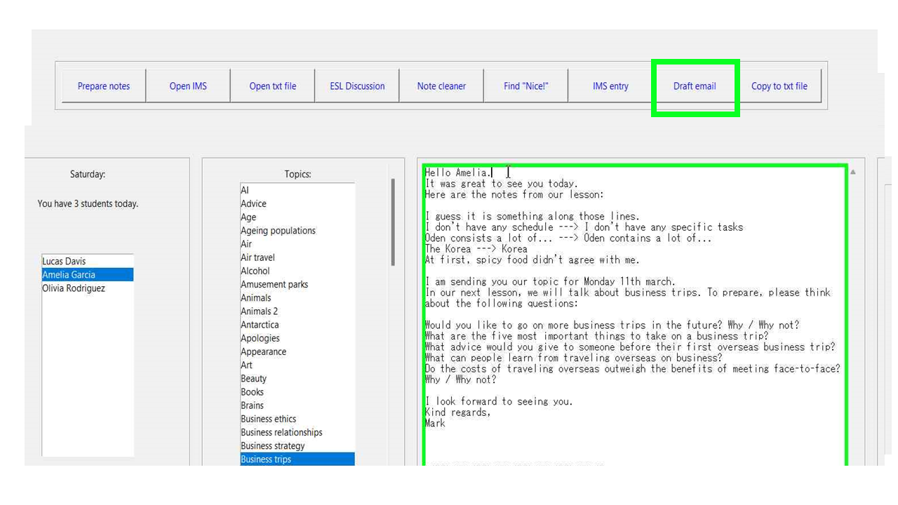

# UI_for_lessons
A simple UI for preparing lessons, recording attendance, cleaning notes, and sending emails for online English lessons.

## Description
A simple UI to assist with:

* Preparing lessons

* Recording attendance

* Opening student files

* Cleaning lesson notes

* Writing emails

* Checking for nice phrases the student has used

* Giving an overview of the current day's lessons

## Dependencies

Python 3

Modules used:

* tkinter 

* datetime

* subprocess

* pyautogui

* time

* pyperclip

* webbrowser

* os

* tkinter.messagebox

* itertools

* tktooltip

## Installing

Example txt files are included in the "Students" folder. Please save this folder in the same location as .exe file.

## How to use

Tooltips will be shown when hovering over each section or button.

## Authors

Mark Nettleship

mnettleship.dev@gmail.com

## Images

This first image shows an overview of the UI. The correct students for each day are automatically shown on the left-hand side. 

Buttons to control the various functions can be seen in a row at the top of the screen.

The large blank textbox will be used to display the output of the functions.

The second image shows an example of a tooltip, which is shown when the user hovers their cursor over one of the function buttons.

The third image shows the user selecting a student from today's list of students.

By clicking on a topic, the user can see the list of questions to make sure they are suitable for the student.

The above image shows the output of the "note cleaner" button, so that the user can check that all unecessary spaces and text was removed.

This image shows the draft email which is created by clicking the "draft email" button. The name of the student, their cleaned notes, and questions for their next topic are automatically inserted into the email template with the correct formatting.

